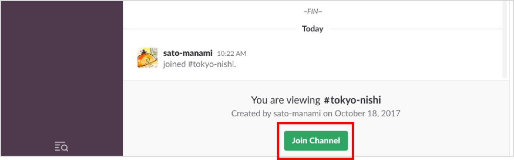
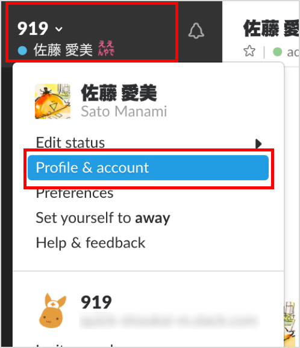

# slack の初期設定と使い方
2017/10/24 sato manami

---

## 目次
- 画面の見方
  - 最初の画面
  - 基本メニュー
  - メッセージメニュー
- 初期設定
  - チャンネルJoin
  - プロフィール変更
- このやり方だけは覚えてほしい！
  - クイックスイッチ
  - 通知設定
- リンク集

---

## 画面の見方

+++

### 最初の画面

+++

### 基本メニュー

+++

### メッセージメニュー1

+++

### メッセージメニュー2

---

## 初期設定

+++

### チャンネルJoin
#### 1. チャンネルメニューの**Channels** をクリック  

+++

#### 2. チャンネル名を検索して、参加したいチャンネルをクリック  

+++

#### 3. **Join Channel** をクリックして参加完了！  

+++

### プロフィール変更
#### 1. 自分のアイコンをクリック  

+++

#### 2. **Edit your Profile** をクリック  

+++

#### 3. 変更が完了したら**Save Changes** をクリック  

---

## このやり方だけは覚えてほしい！

+++

### クイックスイッチ

+++

### 通知設定

---

## リンク集

+++

- [slackヘルプセンター](https://get.slack.help/hc/ja)
- [slack用語集](https://get.slack.help/hc/ja/articles/213817348-Slack-%E7%94%A8%E8%AA%9E%E9%9B%86)
- [全職種必見！9つのSlackお作法で慮り力の高いコミュニケーションを目指す](http://manualog.net/slack-rules-660)
